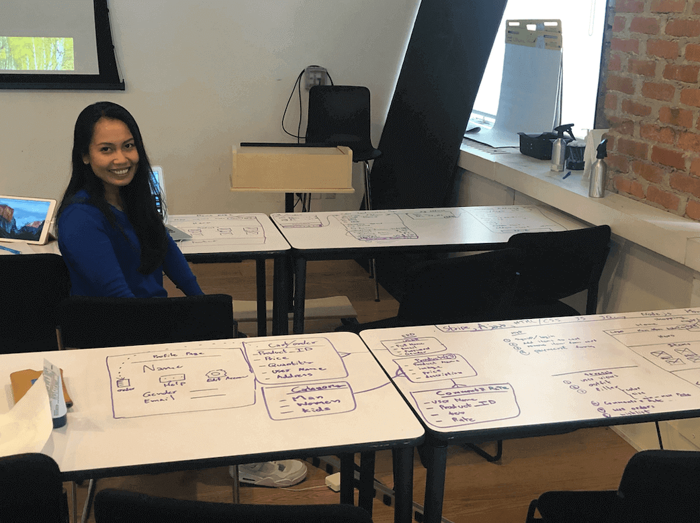
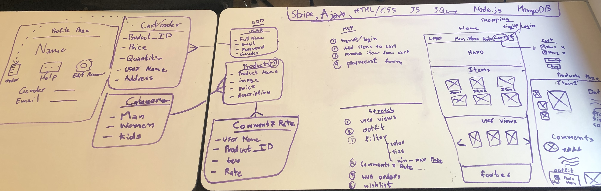
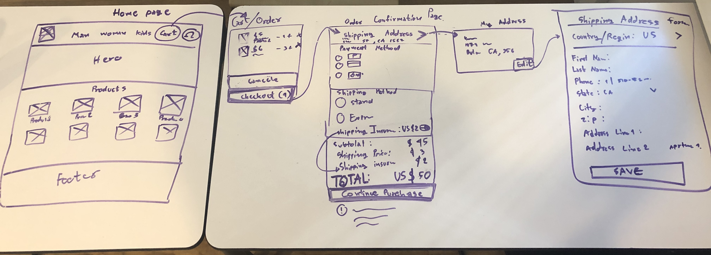

# AP Shopping online

This app ....

* [Link to project hosted on Heroku](https://#name.herokuapp.com/)
* [Link to project hosted on Github](https://github.com/kanjamad/e-commerce-API)
* [Link to project hosted on trello](https://trello.com/b/tk3FQbjQ/final-project)

---

## app file tree

```
.
├── README.md
├── assets
│   ├── css
│   │   └── style.css
│   ├── images
│   └── javascript
│       └── script.js
└── index.html

```

---

## Deadlines

###### When is the project due?

* **Wednesday, May 29th, 2019** - [Project planning deliverables](#project-planning-deliverables) due! Before beginning work on your project, your idea, project scope, and other planning deliverables must be approved by an instructor.

* **9:00pm, Friday, June 7th, 2019** - Feature Freeze

* **9:30am, Monday, June 10th, 2019** - [Completed project deliverables](#completed-project-deliverables) due and presentations!

---

### Planning
Brainstorm => I use 4 tables to write my project ideal, draw wireframs, write entity relationship diagram (ERD).



ERD, MVP, Strech goal, wireframs Profile page and Product page



Wireframs for home page, order comfirmation form and my address page



---

## Additional Resources
1. <a href="http://expressjs.com/starter/installing.html" target="_blank">Starting an Express Project</a>