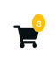
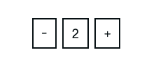
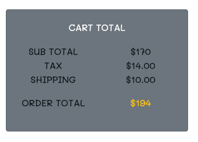
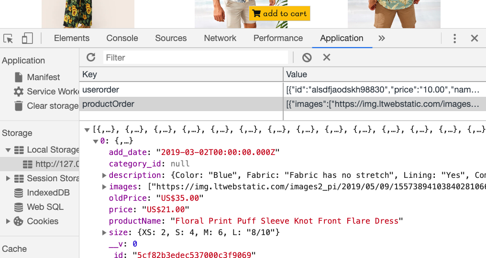
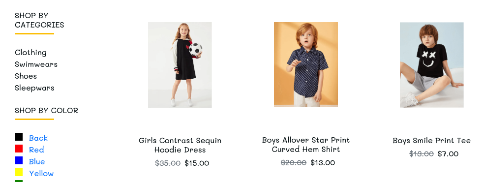
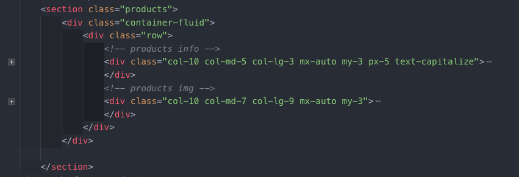

# AP Shopping online

This app ....

* [Link to project hosted on Heroku](https://#name.herokuapp.com/)
* [Link to project hosted on Github](https://github.com/kanjamad/app-E-commerce)
* [Link to project hosted on trello](https://trello.com/b/tk3FQbjQ/final-project)
* [Link to backend API server project hosted on heroku](https://kanjamadapishopping.herokuapp.com/)
* [Link to backend API server project hosted on Github](https://github.com/kanjamad/e-commerce-API)

---

## MVP
1. SignUp
2. Login
3. Add products to cart
4. Remove products from cart


___

## User Users stories
1. User can signup/login.
2. User can Edit your Profile.
3. User can add products to cart and remove products.
6. User can shopping from category.
7. User can add products, remove products from cart with out login.
8. User need to login if want to order.


___
## Strech Goal
1. User can edit shipping address.
2. User can see your old products.
3. User need to login if want to order and write comment.
4. User can comment and rate.
5. User can payment ( paypal or stripe)


___

## Technology

### Front end
1. HTML/CSS
2. Bootstrap
3. AJAX
4. JavaScrip
5. jQuery
6. webfonts


### Backend
1. Node.js
2. MogoDB
5. nodemon
6. Mongoose

___

## app file tree

```
.
├── README.md
├── assets
│   ├── css
│   │   └── style.css
│   ├── images
│   │   ├── kanjamadBosel-project.png
│   │   ├── logo-page.png
│   │   ├── logo.png
│   │   ├── page-down.jpg
│   │   └── page-top.jpg
│   ├── images-cart
│   └── javascript
│       ├── jquery-3.4.1.js
│       └── script.js
├── index.html
├── kids.html
├── men.html
├── singleproduct.html
├── store.html
└── women.html
```

---

## Highlighted code



```
<!-- CSS -->

.cart-items {
  color: var(--mainWhite);
  position: absolute;
  top: -15%;
  right: -25%;
  padding: 0.2rem 0.3rem;
  background: var(--mainYellow);
  font-size: 0.1rem;
  border-radius: 50%;
}

```


```
<!-- CSS -->

.featured-container {
  background: var(--mainWhite);
  position: relative;
  overflow: hidden;
}
.featured-store-link {
  background: var(--mainYellow);
  color: var(--mainBlack);
  padding: 0.2rem 0.4rem;
  position: absolute;
  right: 0;
  top: 70%;
  transform: translateX(110%);
  transition: all 1s ease-in-out;
}
.featured-container:hover .featured-store-link {
  transform: translateX(0%);
}
```




```
// ----------------------- Update Product Quantity -----------------------

$($orderData).on("click", (e) => {

    // (+)
    if (e.target.classList.contains("addOrder")) {
        console.log('ADD ORDER');
        let id = e.target.getAttribute('data-id');
        console.log(id);
        let tempProduct = cart.find(product => product._id === id);
        tempProduct.amount = tempProduct.amount ? tempProduct.amount + 1 : tempProduct.amount = 2;
        localStorage.setItem('productOrder', JSON.stringify(cart));
        renderOrder(cart);
    // (-)
    } else if (e.target.classList.contains("removeOrder")) {
        console.log('REMOVE ORDER');
        let id = e.target.getAttribute('data-id');
        console.log(id);
        let tempProduct = cart.find(product => product._id === id);
        if (tempProduct.amount > 1) {
            tempProduct.amount = tempProduct.amount ? tempProduct.amount -1 : tempProduct.amount = 1;
            localStorage.setItem('productOrder', JSON.stringify(cart));
            renderOrder(cart);
        }
    }
});

```




```
renderOrder(ordersArr) => {
    const $cartTotal = $('#cart-total');
    const $pricePay = $('#price-pay');
    const $cartItems = $('.cart-items');
    $orderData.empty();
    const ordersHtml = getAllProductLocalHtml(ordersArr);
    $orderData.append(ordersHtml);
    let total = 0.00;
    let finalPay = 24;
    let numberOnCart = 0;

    //  total price
    cart.forEach(item => {
        const amount = item.amount || 1;
        total += item.price * amount;
    });
    $cartTotal.text(`$${total}`);

    // caculate total price + tax + shipping
    totalAmount = total + finalPay
    $pricePay.text(`$${totalAmount}`);  

    // number QUANTITY on navbar on cart icon
    cart.forEach(iconOnCart => {
        const numberItem = iconOnCart.numberItem ||1;
        numberOnCart += iconOnCart.amount * numberItem;
    });
    $cartItems.text(`${numberOnCart}`);
};

```




```

 handleSuccess(json) => {
    console.log(json.data);
    renderProduct(json.data);

// --------- save product to localStorage ------------
    const products = JSON.stringify(json.data);
    localStorage.setItem('productOrder', products);
    const productStoredOrder = localStorage.getItem('productOrder');
    const productOrderObj = JSON.parse(productStoredOrder)
    console.log(productOrderObj)
};

```


### Bootstrap Products page category column





---

### CSS units for font-size: px | em | rem

px
Pixels (px) are referred to as absolute units because they will always be the same size regardless of any other related settings.What if a user changes the default font-size of browser (or device)? Your header’s font-size (say 20px) will remain 20 px.

em
An em is equal to the computed font-size of that element’s parent. For example, If there is a div element defined with font-size: 16px then for that div and for its children 1em = 16px.

rem
Values are relative to the root html element, not to the parent element. That is, If font-size of the 
root elemnt is 16px then 1 rem = 16px for all elements.If font-size is not explicitly defined in root element then 1rem will be equal to the default font-size provided by the browser (usually 16px).


---

## Deadlines

###### When is the project due?

* **Wednesday, May 29th, 2019** - [Project planning deliverables](#project-planning-deliverables) due! Before beginning work on your project, your idea, project scope, and other planning deliverables must be approved by an instructor.

* **9:00pm, Friday, June 7th, 2019** - Feature Freeze

* **9:30am, Monday, June 10th, 2019** - [Completed project deliverables](#completed-project-deliverables) due and presentations!

---

### Planning
Brainstorm => I use the tables to draw out my ideas for the project., draw wireframes, write entity relationship diagram (ERD).


ERD, MVP, Strech goal, wireframes Profile page and Product page


Wireframs for home page, order comfirmation form and my address page


---

## Additional Resources
1. <a href="https://www.iconfinder.com/search/?q=shopping" target="_blank">Shopping icon</a>
2. <a href="https://fontawesome.com/" target="_blank"> Navbar Icon</a>
3. <a href="https://jquery.com/download/" target="_blank"> Downloading jQuery </a>
4. <a href="https://git.generalassemb.ly/sf-sei-1/intro-to-jquery" target="_blank"> Intro to jQuery </a>
5. <a href="http://www.stickpng.com/" target="_blank"> Images </a>
6. <a href="https://fonts.google.com/" target="_blank"> Google Fonts </a>
7. <a href="https://google-webfonts-helper.herokuapp.com/fonts/courgette?subsets=latin" target="_blank"> Google-webfonts-helper </a>
8. <a href="https://medium.com/free-code-camp/the-css-handbook-a-handy-guide-to-css-for-developers-b56695917d11" target="_blank"> The CSS Handbook </a>
9. <a href="https://developer.mozilla.org/en-US/docs/Learn/CSS/Introduction_to_CSS/Values_and_units" target="_blank"> CSS values and units </a>
10. <a href="https://getbootstrap.com/docs/4.0/utilities/spacing/" target="_blank"> Bootstrap Spacing </a>
11. <a href="https://getbootstrap.com/docs/4.0/components/jumbotron/" target="_blank"> Bootstrap Jumbotron </a>
12. <a href="https://codyhouse.co/gem/mega-dropdown" target="_blank"> mega-dropdown component </a>
13. <a href="https://api.jquery.com/jquery.ajax/#jQuery-ajax-url-settings" target="_blank"> jQuery.ajax() </a>
14. <a href="https://developer.mozilla.org/en-US/docs/Web/API/Window/localStorage" target="_blank"> Window​.local​Storage </a>
15. <a href="https://developer.mozilla.org/en-US/docs/Web/API/Window/location" target="_blank"> Window​.location </a>
 